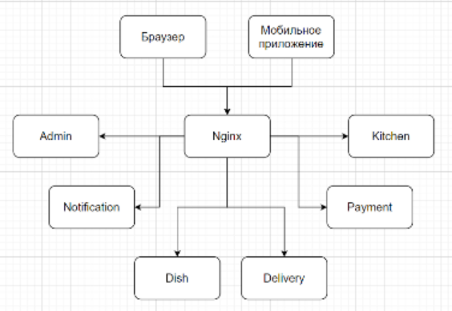

# job4j_fast_food
Проект 'Быстро и в Точку'. Приложение для бизнесов Быстрой Еды. Основано на:
- REST.
- микросервисы.<br>
Проект приложения будет иметь модульную структуру. Каждый модуль это отдельное Spring boot приложение
## Функционал приложения.
- каталог блюд
- принимать заказ на сайте
- принимать заказ через мобильное приложение
- предоставлять по желанию заказчика курьерскую доставку
- контроль положения курьера с заказом.
- приложение для курьера для отслеживания положения и отчитаться о заказе
- имеет админку в виде веб приложения, заказать продукты и видеть отчеты.

## Структура проекта job4j_fast_food

<table>
  <tbody>
    <tr>
      <th> № </th>
      <th> Каталог </th>
      <th> Назначение </th>
    </tr>
    <tr>
      <th> 1 </th>
      <td> /admin/ </td>
      <td> админка </td>
    </tr>
    <tr>
      <th> 2 </th>
      <td> /dish/ </td>
      <td> сервис блюд </td>
    </tr>
    <tr>
      <th> 3 </th>
      <td> /order/ </td>
      <td> сервис заказов </td>
    </tr>
    <tr>
      <th> 4 </th>
      <td> /delivery/ </td>
      <td> сервис доставки </td>
    </tr>
    <tr>
      <th> 5 </th>
      <td> /kitchen/ </td>
      <td> сервис кухни </td>
    </tr>
    <tr>
      <th> 6 </th>
      <td> /payment/ </td>
      <td> сервис платежей </td>
    </tr>
    <tr>
      <th> 7 </th>
      <td> /notification/ </td>
      <td> сервис уведомлений </td>
    </tr>
    <tr>
      <th> 8 </th>
      <td> /domain/ </td>
      <td> доменные модели </td>
    </tr>
  </tbody>
</table>

Это MAVEN многомодульный проект. В каждой папке лежит свой POM.XML.
Связи сервисов.
</img>

## Rest API
Идея Rest API базируется на выполнении CRUD запросов к сервису через запросы HTTP.
Приложение выполняет запросы для <b>person<b>:
<table>
  <tbody>
    <tr>
      <th> № </th>
      <th> http запрос </th>
      <th> CRUD </th>
      <th> действие </th>
    </tr>
    <tr>
      <th> 1 </th>
      <td> GET/person/ </td>
      <td> Read </td>
      <td> список всех пользователей </td>
    </tr>
    <tr>
      <th> 2 </th>
      <td> GET/person/{id} </td>
      <td> Read </td>
      <td> прочитать пользователя с id </td>
    </tr>
    <tr>
      <th> 3 </th>
      <td> POST/person/ </td>
      <td> Create </td>
      <td> создает пользователя </td>
    </tr>
    <tr>
      <th> 4 </th>
      <td> PUT/person/ </td>
      <td> Update </td>
      <td> обновляет пользователя </td>
    </tr>
    <tr>
      <th> 5 </th>
      <td> DELETE/person/{id} </td>
      <td> Delete </td>
      <td> удаляет пользователя с id</td>
    </tr>
  </tbody>
</table>


## Архитектура приложения
Приложение должно состоять из 3х слоёв: Controller, Service, Persistence.
<table>
  <tbody>
    <tr>
      <th> № </th>
      <th> слой </th>
      <th> путь в проекте </th>
    </tr>
    <tr>
      <th> 1 </th>
      <td> модель </td>
      <td> src/main/java/ru/job4j/auth/model </td>
    </tr>
    <tr>
      <th> 2 </th>
      <td> контроллер </td>
      <td> src/main/java/ru/job4j/auth/controller </td>
    </tr>
    <tr>
      <th> 3 </th>
      <td> сервис </td>
      <td> src/main/java/ru/job4j/auth/service </td>
    </tr>
    <tr>
      <th> 4 </th>
      <td> персистенс </td>
      <td> src/main/java/ru/job4j/auth/repository </td>
    </tr>
  </tbody>
</table>

## БД
База данных содержать таблицу:
- person - таблица с описанием пользователей.

## Технологии:
В проекте использованы:
- java 17,
- СУБД PostgreSQL 15,
- Spring boot 2.7.3,
- liquibase 3.6.2,
- h2database 2.1.214,
- Maven 3.8,
- checkstyle 3.1.2,
- REST
- json
- микросервисы
- Nginx

## Список ПО:
### - git
Установить с сайта: https://git-scm.com/downloads

### - java 17
Установить с сайта: https://www.oracle.com/java/technologies/downloads/

### - IntelliJ IDEA 2022.3.1 (Community Edition)
Установить с сайта: https://www.jetbrains.com/ru-ru/idea/

### - Maven 3.8
Установить с сайта: https://maven.apache.org/install.html

### - PostgreSQL 15
Установить с сайта: https://www.postgresql.org/download/

### - REST
Открыть в веб броузере: https://start.spring.io/

### - Curl
Установить с сайта: https://curl.haxx.se/download.html

### - json
Описание json формата https://www.json.org/


## To Do

### Создание репозитория

Нужно открыть сайт ```github.com``` и войти под своими учётными данными. Выбрать свои репозитории (рисунок 1).<br>
<div style="width: 100%; padding-left: 10%; padding-right: 10%; text-align: center;">

<p>Рисунок 1.</p>
</div>

В окне нужно ввести название репозиторя, описание и заполнить другие настройки если нужны (рисунок 2).<br>

<div style="width: 100%; padding-left: 10%; padding-right: 10%; text-align: center;">

<p>Рисунок 2.</p>
</div>

В конце страницы нажать кнопку создать репозиторий - 'create repository' (рисунок 3).<br>

<div style="width: 100%; padding-left: 10%; padding-right: 10%; text-align: center;">

<p>Рисунок 3.</p>
</div>

Сохраните ссылку на проект в буфер клавиатуры (сочетание кнопок ```ctrl``` + ```c```).

### Клонирование репозитория в intelliJ IDEA 
Запустите intelliJ IDEA.<br>
Откройте проект кнопкой ```Get from VCS``` (рисунок 4)<br>
<div style="width: 100%; padding-left: 10%; padding-right: 10%; text-align: center;">

<p>Рисунок 4.</p>
</div>

В окне введите ссылку из буфера клавиатуры, сочетание кнопок ```ctrl```+```v``` (рисунок 5) и нажмите кнопку 'Clone'.<br>
<div style="width: 100%; padding-left: 10%; padding-right: 10%; text-align: center;">

<p>Рисунок 5.</p>
</div>

### Генерация заготовки Spring REST проекта
Откройте в веб броузере страницу: https://start.spring.io/ .
Заполните поля страницы как рисунке 6 и добавите зависимости:<br>
- Lombok
- Spring Web
- Spring Data JPA
- PostgreSQL Driver
- H2 Database
- Liquibase Migration
И нажмите кнопку ```GENERATE```.
  В окне введите ссылку из буфера клавиатуры, сочетание кнопок ```ctrl```+```v``` (рисунок 5) и нажмите кнопку 'Clone'.<br>
<div style="width: 100%; padding-left: 10%; padding-right: 10%; text-align: center;">

<p>Рисунок 6.</p>
</div>

Скачайте полученный архив с проектом. Распакуйте проект в папку с проектом в intelliJ IDEA.
В intelliJ IDEA в меню 'File' выбрать пункт 'Reload All from Disk'. 

### Настройка миграции БД в проекте liquibase
В корне проекта найти файл 'pom.xml'.
Нужно добавить в файл профили:
```xml
	<profiles>
		<profile>
			<id>test</id>
			<properties>
				<liquibase.config>db/liquibase_test.properties</liquibase.config>
			</properties>
			<activation>
				<activeByDefault>true</activeByDefault>
			</activation>
		</profile>
		<profile>
			<id>production</id>
			<properties>
				<liquibase.config>db/liquibase.properties</liquibase.config>
			</properties>
		</profile>
	</profiles>
```
И секцию:
```xml
	<build>
		<plugins>
			<plugin>
				<groupId>org.springframework.boot</groupId>
				<artifactId>spring-boot-maven-plugin</artifactId>
				<configuration>
					<excludes>
						<exclude>
							<groupId>org.projectlombok</groupId>
							<artifactId>lombok</artifactId>
						</exclude>
					</excludes>
				</configuration>
			</plugin>
			<plugin>
				<groupId>org.liquibase</groupId>
				<artifactId>liquibase-maven-plugin</artifactId>
				<version>4.15.0</version>
				<configuration>
					<propertyFile>${liquibase.config}</propertyFile>
				</configuration>
				<executions>
					<execution>
						<phase>process-resources</phase>
						<goals>
							<goal>clearCheckSums</goal>
							<goal>update</goal>
						</goals>
					</execution>
				</executions>
			</plugin>
			<plugin>
				<groupId>org.apache.maven.plugins</groupId>
				<artifactId>maven-checkstyle-plugin</artifactId>
				<version>3.1.2</version>
				<dependencies>
					<dependency>
						<groupId>com.puppycrawl.tools</groupId>
						<artifactId>checkstyle</artifactId>
						<version>9.0</version>
					</dependency>
				</dependencies>
				<executions>
					<execution>
						<id>validate</id>
						<phase>validate</phase>
						<configuration>
							<configLocation>checkstyle.xml</configLocation>
							<encoding>UTF-8</encoding>
							<consoleOutput>true</consoleOutput>
							<failsOnError>true</failsOnError>
							<includeTestSourceDirectory>true</includeTestSourceDirectory>
						</configuration>
						<goals>
							<goal>check</goal>
						</goals>
					</execution>
				</executions>
			</plugin>
		</plugins>
	</build>
```
В корне проекта создать папку 'db'. В папке создать файлы:<br>
<b>liquibase.properties</b>
```properties
changeLogFile:src/main/resources/db/changelog/db.changelog-master.xml
url: jdbc:postgresql://127.0.0.1:5432/fullstack_auth
username: postgres
password: password
```
и файл <b>liquibase_test.properties</b>
```properties
changeLogFile: src/main/resources/db/changelog/db.changelog-master.xml
url: jdbc:h2:./testdb;MODE=PostgreSQL;CASE_INSENSITIVE_IDENTIFIERS=TRUE;
username:
password:
```
Нужно создать папки для скриптов liquibase:
'src/main/resources/db/changelog'
'src/main/resources/db/changelog/scripts'

В папку 'src/main/resources/db/changelog' положить файл <b>db.changelog-master.xml</b>:
```xml
<?xml version="1.0" encoding="UTF-8"?>
<databaseChangeLog
        xmlns="http://www.liquibase.org/xml/ns/dbchangelog"
        xmlns:xsi="http://www.w3.org/2001/XMLSchema-instance"
        xmlns:ext="http://www.liquibase.org/xml/ns/dbchangelog-ext"
        xsi:schemaLocation="http://www.liquibase.org/xml/ns/dbchangelog http://www.liquibase.org/xml/ns/dbchangelog/dbchangelog-3.1.xsd
    http://www.liquibase.org/xml/ns/dbchangelog-ext http://www.liquibase.org/xml/ns/dbchangelog/dbchangelog-ext.xsd">
    <include file="scripts/001_ddl_create_person_table.sql" relativeToChangelogFile="true"/>
    <include file="scripts/002_dml_insert_to_person_table.sql" relativeToChangelogFile="true"/>
</databaseChangeLog>
```
В папку 'src/main/resources/db/changelog/scripts' положить 2 файла:
<b>001_ddl_create_person_table.sql</b>
```postgres-psql
drop table if exists person;
create table person (
    id serial primary key not null,
    login varchar(2000),
    password varchar(2000)
);

comment on table person is 'Список пользователей';
comment on column person.id is 'идентификатор пользователя';
comment on column person.login is 'Имя пользователя';
comment on column person.password is 'Пароль пользователя';
```

<b>002_dml_insert_to_person_table.sql</b>
```postgres-psql
insert into person (login, password) values ('parsentev', '123');
insert into person (login, password) values ('ban', '123');
insert into person (login, password) values ('ivan', '123');
```
В папке 'src/main/resources' создать файл свойтв приложения <b>application.properties</b>
```properties
spring.liquibase.change-log=classpath:/db/changelog/db.changelog-master.xml
spring.datasource.url=jdbc:postgresql://127.0.0.1:5432/fullstack_auth
spring.datasource.username=postgres
spring.datasource.password=password
spring.datasource.driver-class-name=org.postgresql.Driver
spring.jpa.database-platform=org.hibernate.dialect.PostgreSQLDialect
spring.jpa.show-sql=true
spring.jpa.properties.hibernate.jdbc.lob.non_contextual_creation=true
```
Навести курсор мыши на файл '<b><i>pom.xml</i></b>' в окне и нажать правую кнопку для вызова меню.
В попап меню выбрать пункт 'open as maven project'.
### Модель Person 
Добавим сущность - модель.
Файл '<b>src/main/java/ru/job4j/auth/model/Person.java</b>'
```java
package ru.job4j.auth.model;

import lombok.Data;
import javax.persistence.Entity;
import javax.persistence.GeneratedValue;
import javax.persistence.GenerationType;
import javax.persistence.Id;

/**
 * Зеленский Н. aka Nike Z.
 * Сущность Person
 */
@Entity
@Data
public class Person {
    @Id
    @GeneratedValue(strategy = GenerationType.IDENTITY)
    private int id;

    private String login;

    private String password;
}
```

### Персистенс для Person
Добавим файл '<b>src/main/java/ru/job4j/auth/repository/PersonRepository.java</b>'<br>
```java
package ru.job4j.auth.repository;

import org.springframework.data.repository.CrudRepository;
import ru.job4j.auth.model.Person;

public interface PersonRepository extends CrudRepository<Person, Integer> {
}
```
### Контроллер Rest для Person
Добавим файл '<b>src/main/java/ru/job4j/auth/controller/PersonController.java</b>'<br>
```java
package ru.job4j.auth.controller;

import org.springframework.data.util.Streamable;
import org.springframework.http.HttpStatus;
import org.springframework.http.ResponseEntity;
import org.springframework.web.bind.annotation.*;
import ru.job4j.auth.model.Person;
import ru.job4j.auth.repository.PersonRepository;

import java.util.List;

/**
 * Rest контроллер для Person
 */
@RestController
@RequestMapping("/person")
public class PersonController {
    private final PersonRepository persons;

    public PersonController(final PersonRepository persons) {
        this.persons = persons;
    }

    /**
     * Получить список всех {@link ru.job4j.auth.model.Person}
     * @return тип {@link java.util.List<ru.job4j.auth.model.Person>}
     * список хранящихся Person в сервисе.
     */
    @GetMapping("/")
    public List<Person> findAll() {
        return Streamable.of(this.persons.findAll()).toList();
    }

    /**
     * Получить {@link ru.job4j.auth.model.Person} по {@param id}
     * @param id - идентификатор тип int.
     * @return тип {@link org.springframework.http.ResponseEntity<ru.job4j.auth.model.Person>}
     */
    @GetMapping("/{id}")
    public ResponseEntity<Person> findById(@PathVariable int id) {
        var person = this.persons.findById(id);
        return new ResponseEntity<Person>(
                person.orElse(new Person()),
                person.isPresent() ? HttpStatus.OK : HttpStatus.NOT_FOUND
        );
    }

    /**
     * Сервис добавляет сущность Person в хранилище сервера
     * @param person - добавляемая сущность тип {@link ru.job4j.auth.model.Person}
     * @return тип {@link org.springframework.http.ResponseEntity<ru.job4j.auth.model.Person>}
     * содержит результат попытки добавить сущность Person.
     */
    @PostMapping("/")
    public ResponseEntity<Person> create(@RequestBody Person person) {
        return new ResponseEntity<Person>(
                this.persons.save(person),
                HttpStatus.CREATED
        );
    }

    /**
     * Сервис обновляет сущность Person в хранилище сервера
     * @param person - сохраняемая сущность тип {@link ru.job4j.auth.model.Person}
     * @return тип {@link org.springframework.http.ResponseEntity<java.lang.Void>}
     */
    @PutMapping("/")
    public ResponseEntity<Void> update(@RequestBody Person person) {
        this.persons.save(person);
        return ResponseEntity.ok().build();
    }

    /**
     * Сервис удаляет сущность Person в хранилище сервера по {@param id}
     * @param id - удаляемая сущность тип int.
     * @return тип {@link org.springframework.http.ResponseEntity<java.lang.Void>}
     */
    @DeleteMapping("/{id}")
    public ResponseEntity<Void> delete(@PathVariable int id) {
        Person person = new Person();
        person.setId(id);
        this.persons.delete(person);
        return ResponseEntity.ok().build();
    }
}
```
### Приложение
файл '<b>src/main/java/ru/job4j/auth/AuthApplication.java</b>'<br>
```java
package ru.job4j.auth;

import org.springframework.boot.SpringApplication;
import org.springframework.boot.autoconfigure.SpringBootApplication;

/**
 * Зеленский Н. aka Nike Z.
 * Запуск сервиса
 */
@SpringBootApplication
public class AuthApplication {

	public static void main(String[] args) {
		SpringApplication.run(AuthApplication.class, args);
	}

}
```
## Сохраняем проект.
В "идее":
- Сохраняем все файлы. Меню File -> Save All.
- Метим файлы для коммита. Наводим мышь на файл в окне 'Project'. Файл помечен красным цветом. Нажимаем на мышке правую кнопку - вызываем попап меню.
Выбираем пункты меню Git -> Add.
- Делаем коммит в репозиторий. Меню Git -> Commit. Пишем описание коммита и пушим.

## Развертывание приложения.

### Создание базы данных:
Для работы нужно создать базу данных с именем: <b><i>fullstack_auth</i></b>.
Запустите окно команд БД (ПУСК - Все программы - PostgreSQL 15 - SQL Shell(psql)).
Введите пользователя и пароль б.д.
Создайте б.д. командой: "create database fullstack_auth" <br>
```
Server [localhost]:
Database [postgres]:
Port [5432]:
Username [postgres]:
Пароль пользователя postgres:
psql (15.1)
ПРЕДУПРЕЖДЕНИЕ: Кодовая страница консоли (866) отличается от основной
                страницы Windows (1251).
                8-битовые (русские) символы могут отображаться некорректно.
                Подробнее об этом смотрите документацию psql, раздел
                "Notes for Windows users".
Введите "help", чтобы получить справку.

postgres=# create database fullstack_auth;
 ``` 
### Настройка конфигурации БД в Job4j_auth
Настройки БД хранятся в папке '<i>src/main/resources</i>' файле свойств приложения <b>application.properties</b>.
Строки c настройками:
```properties
spring.datasource.url=jdbc:postgresql://127.0.0.1:5432/fullstack_auth
spring.datasource.username=postgres
spring.datasource.password=password
spring.datasource.driver-class-name=org.postgresql.Driver
spring.jpa.database-platform=org.hibernate.dialect.PostgreSQLDialect
```
Нужно менять настройки, если они у вас отличаются.

### 5. Компиляция и запуск сервиса.
```
mvn spring-boot:run
```
### 6. Запуск сервиса без сборки.
```
cd c:\job4j_auth\target
java -jar job4j_auth-1.0-SNAPSHOT.jar 
```
## Проверка
В качестве клиента можно использовать curl.
Ответы и запросы исползуют формат <b><i>json</i></b>.

Проверка запросов:
1. Получаем список всех пользователей
```properties
curl -i http://localhost:8080/person/
```

2. Получаем данные пользователя с id = 1
```properties
curl -i http://localhost:8080/person/1
```

3. Создадим нового пользователя.
```properties
curl -H "Content-Type:application/json" -X POST -d"{\"login\":\"job4j@gmail.com\",\"password\":\"123\"}" http://localhost:8080/person/
```

4. Обновим созданного пользователя.
```properties
curl -i -H "Content-Type: application/json" -X PUT -d "{\"id\":\"5\",\"login\":\"support@job4j.com\",\"password\":\"123\"}" http://localhost:8080/person/
```

5. И теперь удалим пользователя.
```properties
curl -i -X DELETE http://localhost:8080/person/5
```
